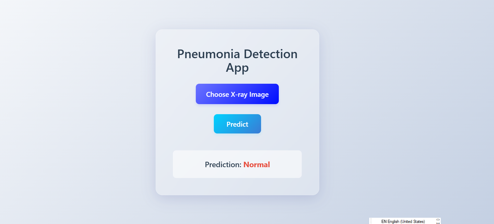

# Pneumonia Detection Deep Learning Model 

This project presents a full-stack web application for pneumonia detection based on chest X-ray images. The backend is implemented in Python using Flask and serves as the inference API for a custom-trained Convolutional Neural Network (CNN) model. The application enables users to upload chest X-ray images and receive diagnostic predictions (Pneumonia vs Normal) via a simple web interface.

# Purpose

Chest X-rays are among the most common diagnostic tools in clinical settings. However, reading them requires trained professionals, and misinterpretation can occur, especially in early stages or in under-resourced areas. The goal of this project is to provide a lightweight, accessible solution for automated pneumonia detection using deep learning, and to make that solution available via a web-based interface.

To this end, a custom deep learning model was trained and evaluated on the publicly available Chest X-Ray Images (Pneumonia) dataset from Kaggle. The model was developed, tested, and validated personally in Google Colab using TensorFlow/Keras. The backend API is responsible for image intake, preprocessing, model loading, and prediction response — forming the core diagnostic engine of the application.

# Tools Used

## Flask (Backend Framework)

Flask is used to define and host the web API endpoints that serve the trained CNN model. It handles routing of image uploads, invokes model inference, and returns predictions to the frontend via a POST request.

## TensorFlow / Keras (Model Training and Inference)

TensorFlow and its high-level API Keras were used for the complete training process of the CNN. Model training was performed in Google Colab using GPU acceleration. The model is saved in `.h5` format and loaded into memory upon server startup for real-time inference.

## Pillow (PIL)

Used to load and preprocess images submitted by the user. X-ray images are resized and converted to match the input shape and format required by the CNN model.

## Pandas

Used during training for analyzing label distributions and reading metadata (if any). In the current backend, it is used only in the training phase, which is not served as part of the live API.

## Matplotlib / Seaborn

Used in model development to visualize class distribution, training history (accuracy/loss over epochs), and evaluate performance with confusion matrices and classification reports.

## ImageDataGenerator (from Keras)

Employed during model training to augment the image dataset, apply real-time transformations (e.g. rotation, zoom, flip), and reduce overfitting.

## OS (Python Standard Library)

Used to handle directory paths and image file management securely within the API logic.

# React 

React.js is used to build the frontend user interface of the application. It provides a responsive and interactive experience for users to upload chest X-ray images and view prediction results in real time. React's component-based architecture enables modular, maintainable, and scalable UI development.

# Trained Model

The model is hosted externally due to GitHub’s file size limitations. It must be downloaded manually and placed in the correct directory before running the backend server.

Download the trained model (.h5): https://drive.google.com/file/d/1GEqdGiinY4xmP1uC70ULR0_O2NhtK0cY/view?usp=sharing

Place the file in:

/backend/model/pneumonia_model.h5

## Project Showcase: 

# How to Run the Backend Locally

1. Clone the repository:
git clone https://github.com/aminaelguenuni/pneumonia-detection.git
cd pneumonia-detection/backend

2. Install dependencies:
pip install -r requirements.txt

3. Place the model file in the /model/ directory as described above.

4. Start the server:
python app.py

# Developer Notes

- The model is based this Kaggle Dataset: https://www.kaggle.com/datasets/tolgadincer/labeled-chest-xray-images
- All training was conducted in Google Colab using the Kaggle pneumonia dataset.
- The backend supports secure file upload, preprocessing, and model inference.
- The project is intended for demonstration and educational purposes only and is not suitable for clinical use.

# Developer

Amina El Guenuni  
- GitHub: https://github.com/aminaelguenuni  
- LinkedIn: www.linkedin.com/in/aminael
